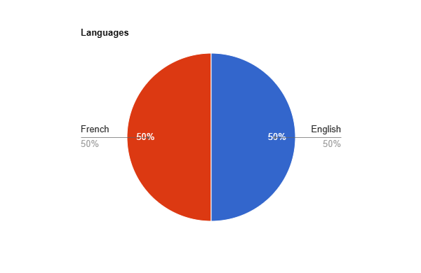

  ### Hello, I'm Titcheu Yamdjeu Pierre Wilfried 👋

## 👨‍💻 Technical Skills

Here are a few technologies I've been working with recently:

 
 
 
 
 
 
 
 
 
 
 
 
 
 
 

## 📈 GitHub Stats

## 🌍 Languages

## 🏆 Achievements
- **Expert in Multiple Programming Languages:** Proficient in C, JavaScript, R, and HTML, with numerous successful projects to show for each.
- **Active GitHub User:** With 27 repositories and counting, I'm always working on something new! 
- **Collaborative and Customer-oriented:** With experience in both programming and customer service, I'm equipped to handle both technical challenges and team dynamics.
- **Lifelong Learner:** I'm constantly working to expand my knowledge and skills. Right now, I'm learning Python along side kubernetes.
- **Language Proficiency:** Fluent in both English and French, which allows me to work effectively in diverse international teams.
- **Pull Shark Achievement:** For my significant contributions to collaborative projects on GitHub.
- **Anime Chat app Engine:** Developed a Java-based recommendation engine to help anime enthusiasts chat with their next favorite series.

## 📚 Projects
Here are some of the projects that I've worked on:

AES Implementation
R-Shiny Dashboard app
ECharts2Shiny implementation
Cename API
Anime Recommendation

## 🌱 I’m currently learning ...
<Describe what you are currently learning>

## 👯 I’m looking to collaborate on ...
<Describe the kind of projects or technologies you are looking to collaborate on>

## 🤔 I’m looking for help with ...
<Describe what you need help with>
  
## 💬 Ask me about ...
<Describe what people can ask you about, such as areas of expertise or interests>

## 📫 How to reach me:
You can reach me at:

- : <pierretypw@gmail.com>
- : TITCHEU YAMDJEU Pierre Wilfried
- : typw01

## ⚡ Fun fact:
<Share a fun fact about yourself>
